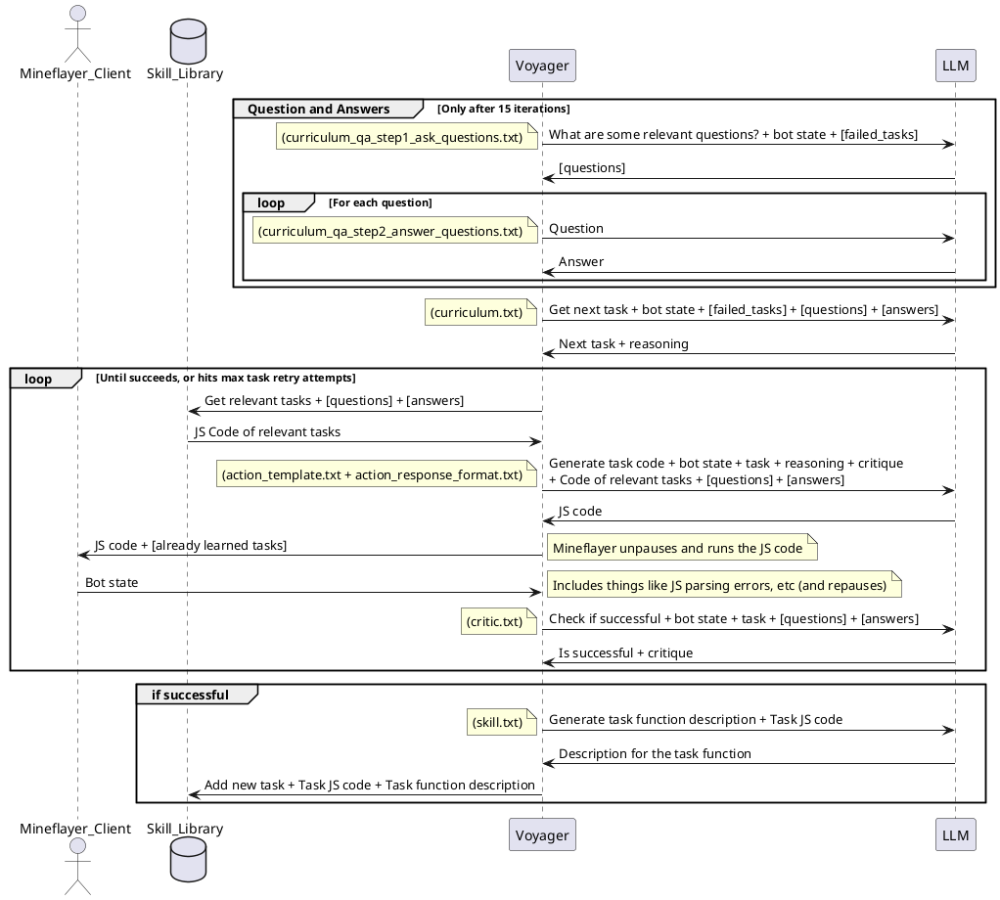
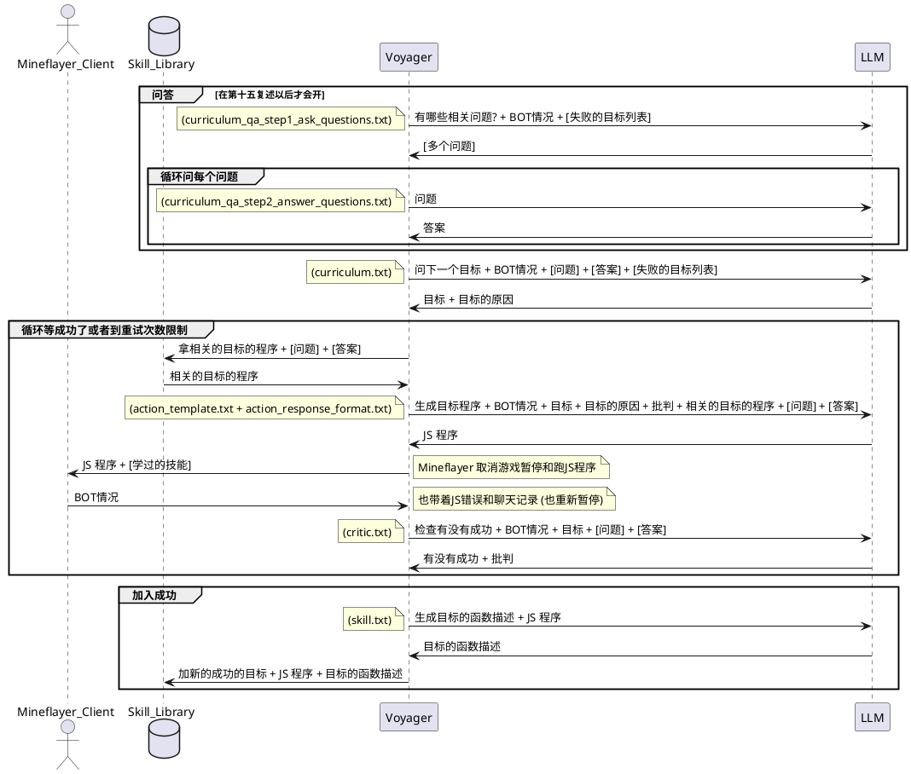

# training loop pseudocode:
```python

iterations = 0
while iterations < max_iterations:
    if completed_tasks.length < warm_up:
        task, context = curriculum.LLM_get_next_task(bot.state().filter(key.warm_up <= completed_tasks.length and 80% chance))
    else:
        questions = curriculum.LLM_get_questions(bot.state())
        answers = curriculum.LLM_get_answers(questions)
        task, context = curriculum.LLM_get_next_task(questions, answers, bot.state().filter(key.warm_up <= completed_tasks.length and 80% chance))
    
    repeat max_task_retry:
        task_code = action_agent.LLM_generate_task_code(task, context, critique, bot.state(), skill_manager.get_relavant_programs(task_context))
        iterations++
        if task_code is valid:
            bot.run(task_code, skill_manager.all_programs)
            critique = critic.LLM_check(bot.state(), task)
            
            if critique == success
                break;
            
    if critique == success:
        skill_manager.add_new_skill(task, task_code, skill_manager.LLM_generate_description(task, task_code))
    else:
        skill_manager.add_failed_skill(task)
    
        
```

# task inference pseudocode:
```python
task = "Get a diamond pickaxe"
sub_tasks = decompose_task(task, bot.status()) #inclues task

while progress < sub_tasks.length:
    next_task = sub_tasks[progress]
    context = "Question: "+"How to "+next_task+"\n Answer: "+curriculum.LLM_get_answers("How to "+next_task)
    repeat max_task_retry:
        task_code = action_agent.LLM_generate_task_code(task, context, critique, bot.state(), skill_manager.get_relavant_programs(task_context))
        iterations++
        if task_code is valid:
            bot.run(task_code, skill_manager.all_programs)
            critique = critic.LLM_check(bot.state(), task)
            
            if critique == success
                break;
    if critique == success:
        progress++
    

```

# training loop sequence diagram:




